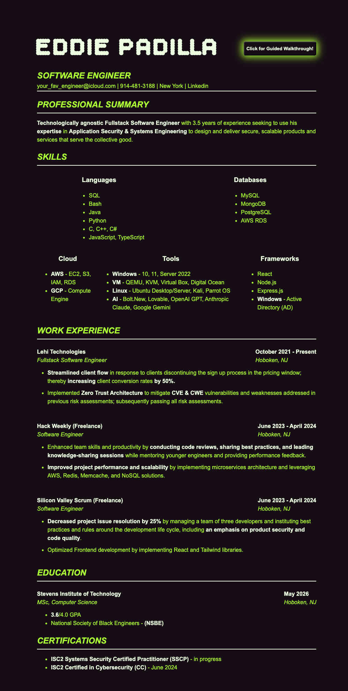

<h1 align="center">
   
  
   
  Interactive Resume
   
</h1>

## Table of Contents

- [Description](#description)
- [Features](#features)
- [Media](#media)

## Description

I've created a static site version of my resume. This is a great alternative for recruiters when they ask for your resume before the initial call, to ensure you're a good initial fit for the role. See the site live - [LIVE RESUME LINK!](https://1dedios.github.io/resume/)

	<code></code>
	<code></code>
	<code></code>
	<code></code>
	<code></code>

Tech Stacks Used:

- HTML, CSS, JavaScript
- Vite.js
- PNPM
- Driver.js
- Github Actions

## Features

- Walkthrough: You're guided through the resume with an interactive tour! Just click the glowing button on the top right.

## Media

There is more to the resume below. As you can see from the image the resume has a button! 😮

